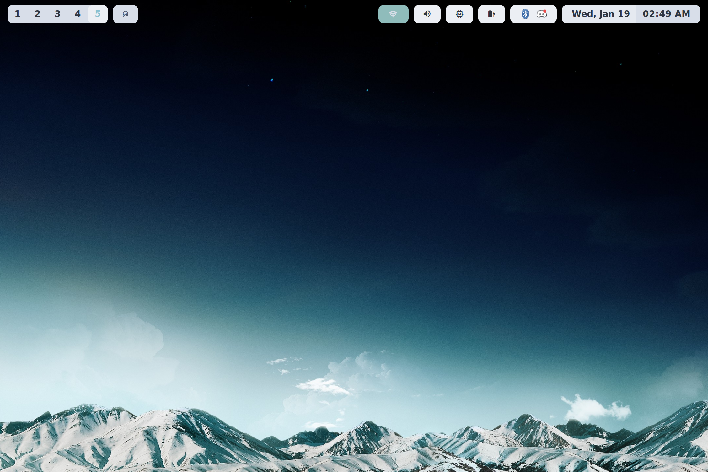
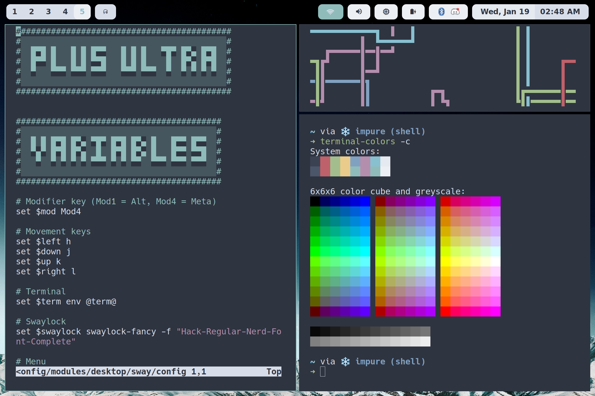
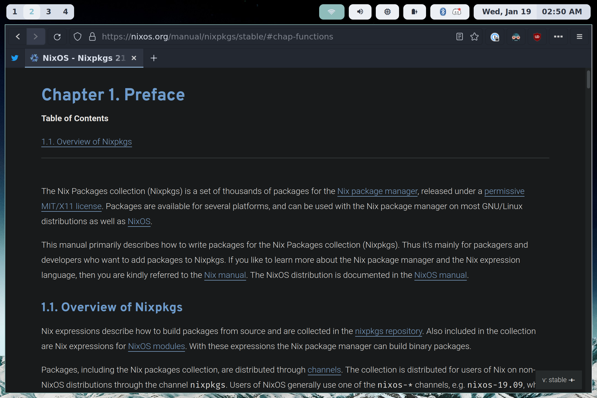

# Plus Ultra

<a href="https://nixos.wiki/wiki/Flakes" target="_blank">
	
</a>
<a href="https://github.com/snowfallorg/lib" target="_blank">
	
</a>

<p>
<!--
	This paragraph is not empty, it contains an em space (UTF-8 8195) on the next line in order
	to create a gap in the page.
-->
  
</p>

> ✨ Go even farther beyond.

- [Screenshots](#screenshots)
- [Overlays](#overlays)
- [Packages](#packages)
  - [`at`](#at)
  - [`bibata-cursors`](#bibata-cursors)
  - [`cowsay-plus`](#cowsay-plus)
  - [`doukutsu-rs`](#doukutsu-rs)
  - [`firefox-nordic-theme`](#firefox-nordic-theme)
  - [`frappe-books`](#frappe-books)
  - [`hey`](#hey)
  - [`infrared`](#infrared)
  - [`kalidoface`](#kalidoface)
  - [`list-iommu`](#list-iommu)
  - [`nix-get-protonup`](#nix-get-protonup)
  - [`nix-update-index`](#nix-update-index)
  - [`nixos-option`](#nixos-option)
  - [`nixos-revision`](#nixos-revision)
  - [`steam`](#steam)
  - [`titan`](#titan)
  - [`twitter`](#twitter)
  - [`ubports-installer`](#ubports-installer)
  - [`ubports-installer-udev-rules`](#ubports-installer-udev-rules)
  - [`wallpapers`](#wallpapers)
  - [`xdg-open-with-portal`](#xdg-open-with-portal)
- [Modules](#modules)
- [Options](#options)

## Screenshots







## Overlays

See the following example for how to apply overlays from this flake.

```nix
{
	description = "";

	inputs = {
		nixpkgs.url = "github:nixos/nixpkgs/release-22.05";
		unstable.url = "github:nixos/nixpkgs";

		snowfall-lib = {
			url = "github:snowfallorg/lib";
			inputs.nixpkgs.follows = "nixpkgs";
		};

		plusultra = {
			url = "github:jakehamilton/config";
			inputs.nixpkgs.follows = "nixpkgs";
			inputs.unstable.follows = "unstable";
		};
	};

	outputs = inputs:
		inputs.snowfall-lib.mkFlake {
			inherit inputs;

			src = ./.;

			overlays = with inputs; [
				# Get all of the packages from this flake by using the main overlay.
				plusultra.overlays.default

				# Individual overlays can be accessed from
				# `plusultra.overlays.<name>`.

				# These overlays pull packages from nixos-unstable or other sources.
				plusultra.overlays.bibata-cursors
				plusultra.overlays.chromium
				plusultra.overlays.comma
				plusultra.overlays.default
				plusultra.overlays.deploy-rs
				plusultra.overlays.discord
				plusultra.overlays.firefox
				plusultra.overlays.flyctl
				plusultra.overlays.freetube
				plusultra.overlays.gamescope
				plusultra.overlays.gnome
				plusultra.overlays.kubecolor
				plusultra.overlays.linux
				plusultra.overlays.lutris
				plusultra.overlays.nordic
				plusultra.overlays.obs
				plusultra.overlays.pocketcasts
				plusultra.overlays.prismlauncher
				plusultra.overlays.tmux
				plusultra.overlays.top-bar-organizer
				plusultra.overlays.yt-music

				# Individual overlays for each package in this flake
				# are available for convenience.
				plusultra.overlays."package/at"
				plusultra.overlays."package/bibata-cursors"
				plusultra.overlays."package/cowsay-plus"
				plusultra.overlays."package/doukutsu-rs"
				plusultra.overlays."package/firefox-nordic-theme"
				plusultra.overlays."package/frappe-books"
				plusultra.overlays."package/hey"
				plusultra.overlays."package/infrared"
				plusultra.overlays."package/kalidoface"
				plusultra.overlays."package/list-iommu"
				plusultra.overlays."package/nix-get-protonup"
				plusultra.overlays."package/nix-update-index"
				plusultra.overlays."package/nixos-option"
				plusultra.overlays."package/nixos-revision"
				plusultra.overlays."package/steam"
				plusultra.overlays."package/titan"
				plusultra.overlays."package/twitter"
				plusultra.overlays."package/wallpapers"
				plusultra.overlays."package/xdg-open-with-portal"
			];
		};
}
```

## Packages

Packages can be used directly from the flake.

```nix
{
	description = "";

	inputs = {
		nixpkgs.url = "github:nixos/nixpkgs/release-22.05";
		unstable.url = "github:nixos/nixpkgs";

		snowfall-lib = {
			url = "github:snowfallorg/lib";
			inputs.nixpkgs.follows = "nixpkgs";
		};

		plusultra = {
			url = "github:jakehamilton/config";
			inputs.nixpkgs.follows = "nixpkgs";
			inputs.unstable.follows = "unstable";
		};
	};

  outputs = inputs:
		inputs.snowfall-lib.mkFlake {
			inherit inputs;

			src = ./.;

			outputs-builder = channels:
				let
					inherit (channels.nixpkgs) system;
					inherit (plusultra.packages.${system})
						hey
						titan
						nixos-option
						nixos-revision
						xdg-open-with-portal;
				in {
					# ...
				};
		};
}
```

### [`at`](./packages/at/default.nix)

[`@`](https://npm.im/@suchipi/at-js) - JavaScript stdio transformation tool.

### [`bibata-cursors`](./packages/bibata-cursors/default.nix)

The [Bibata Cursor](https://github.com/ful1e5/Bibata_Cursor) theme.

### [`cowsay-plus`](./packages/cowsay-plus/default.nix)

A cowsay wrapper that loads random cows.

### [`doukutsu-rs`](./packages/doukutsu-rs/default.nix)

[`doukutsu-rs`](https://github.com/doukutsu-rs/doukutsu-rs) - A fully playable re-implementation of Cave Story (Doukutsu Monogatari) engine written in Rust.

### [`firefox-nordic-theme`](./packages/firefox-nordic-theme/default.nix)

[A dark theme for Firefox](https://github.com/EliverLara/firefox-nordic-theme) created using the [Nord](https://github.com/arcticicestudio/nord) color palette.

### [`frappe-books`](./packages/frappe-books/default.nix)

The AppImage build of [Frappe Books](https://frappebooks.com).

### [`hey`](./packages/hey/default.nix)

A Firefox wrapper for [HEY](https://hey.com).

### [`infrared`](./packages/infrared/default.nix)

A Minecraft [reverse proxy](https://github.com/haveachin/infrared).

### [`kalidoface`](./packages/kalidoface/default.nix)

Runs [Kalidoface](https://kalidoface.com) in Firefox.

### [`list-iommu`](./packages/list-iommu/default.nix)

A helper script to list IOMMU devices.

### [`nix-get-protonup`](./packages/nix-get-protonup/default.nix)

A helper script to install [Proton GE](https://github.com/GloriousEggroll/proton-ge-custom).

### [`nix-update-index`](./packages/nix-update-index/default.nix)

A helper script to fetch the latest index for nix-locate.

### [`nixos-option`](./packages/nixos-option/default.nix)

A flake-enabled version of `nixos-option`.

### [`nixos-revision`](./packages/nixos-revision/default.nix)

A helper script to get the configuration revision of the current system.

### [`steam`](./packages/steam/default.nix)

Extra desktop items for Steam to launch the application in Pipewire mode
or enable the gamepad UI.

### [`titan`](./packages/titan/default.nix)

A JavaScript [monorepo management tool](https://npm.im/@jakehamiton/titan).

### [`twitter`](./packages/twitter/default.nix)

A Firefox wrapper for Twitter.

### [`ubports-installer`](https://devices.ubuntu-touch.io/installer)

Install Ubuntu Touch on mobile devices.

### [`ubports-installer-udev-rules`](https://docs.ubports.com/en/latest/userguide/install.html#missing-udev-rules)

`udev` rules to allow `ubports-installer` to recognize devices.

### [`wallpapers`](./packages/wallpapers/default.nix)

A collection of wallpapers.

### [`xdg-open-with-portal`](./packages/xdg-open-with-portal/default.nix)

A replacement for `xdg-open` that fixes issues when using xwayland.

## Modules

NixOS modules are exported from this flake and can be included in your system configuration.

### [`apps/_1password`](./modules/apps/_1password/default.nix)

### [`apps/ardour`](./modules/apps/ardour/default.nix)

### [`apps/blender`](./modules/apps/blender/default.nix)

### [`apps/bottles`](./modules/apps/bottles/default.nix)

### [`apps/cadence`](./modules/apps/cadence/default.nix)

### [`apps/discord`](./modules/apps/discord/default.nix)

### [`apps/dolphin`](./modules/apps/dolphin/default.nix)

### [`apps/doukutsu-rs`](./modules/apps/doukutsu-rs/default.nix)

### [`apps/element`](./modules/apps/element/default.nix)

### [`apps/etcher`](./modules/apps/etcher/default.nix)

### [`apps/firefox`](./modules/apps/firefox/default.nix)

### [`apps/frappe-books`](./modules/apps/frappe-books/default.nix)

### [`apps/freetube`](./modules/apps/freetube/default.nix)

### [`apps/gimp`](./modules/apps/gimp/default.nix)

### [`apps/gparted`](./modules/apps/gparted/default.nix)

### [`apps/hey`](./modules/apps/hey/default.nix)

### [`apps/inkscape`](./modules/apps/inkscape/default.nix)

### [`apps/logseq`](./modules/apps/logseq/default.nix)

### [`apps/looking-glass-client`](./modules/apps/looking-glass-client/default.nix)

### [`apps/lutris`](./modules/apps/lutris/default.nix)

### [`apps/obs`](./modules/apps/obs/default.nix)

### [`apps/pcsx2`](./modules/apps/pcsx2/default.nix)

### [`apps/pitivi`](./modules/apps/pitivi/default.nix)

### [`apps/pocketcasts`](./modules/apps/pocketcasts/default.nix)

### [`apps/prismlauncher`](./modules/apps/prismlauncher/default.nix)

### [`apps/protontricks`](./modules/apps/protontricks/default.nix)

### [`apps/rpcs3`](./modules/apps/rpcs3/default.nix)

### [`apps/steam`](./modules/apps/steam/default.nix)

### [`apps/steamtinkerlaunch`](./modules/apps/steamtinkerlaunch/default.nix)

### [`apps/twitter`](./modules/apps/twitter/default.nix)

### [`apps/ubports-installer`](./modules/apps/ubports-installer/default.nix)

### [`apps/virtualbox`](./modules/apps/virtualbox/default.nix)

### [`apps/vlc`](./modules/apps/vlc/default.nix)

### [`apps/vscode`](./modules/apps/vscode/default.nix)

### [`apps/winetricks`](./modules/apps/winetricks/default.nix)

### [`apps/yt-music`](./modules/apps/yt-music/default.nix)

### [`apps/yubikey`](./modules/apps/yubikey/default.nix)

### [`apps/yuzu`](./modules/apps/yuzu/default.nix)

### [`archetypes/gaming`](./modules/archetypes/gaming/default.nix)

### [`archetypes/server`](./modules/archetypes/server/default.nix)

### [`archetypes/workstation`](./modules/archetypes/workstation/default.nix)

### [`cli-apps/flake`](./modules/cli-apps/flake/default.nix)

### [`cli-apps/neovim`](./modules/cli-apps/neovim/default.nix)

### [`cli-apps/prisma`](./modules/cli-apps/prisma/default.nix)

### [`cli-apps/proton`](./modules/cli-apps/proton/default.nix)

### [`cli-apps/tmux`](./modules/cli-apps/tmux/default.nix)

### [`cli-apps/wine`](./modules/cli-apps/wine/default.nix)

### [`cli-apps/wshowkeys`](./modules/cli-apps/wshowkeys/default.nix)

### [`cli-apps/yubikey`](./modules/cli-apps/yubikey/default.nix)

### [`desktop/addons/electron-support`](./modules/desktop/addons/electron-support/default.nix)

### [`desktop/addons/firefox-nordic-theme`](./modules/desktop/addons/firefox-nordic-theme/default.nix)

### [`desktop/addons/foot`](./modules/desktop/addons/foot/default.nix)

### [`desktop/addons/gtk`](./modules/desktop/addons/gtk/default.nix)

### [`desktop/addons/kanshi`](./modules/desktop/addons/kanshi/default.nix)

### [`desktop/addons/keyring`](./modules/desktop/addons/keyring/default.nix)

### [`desktop/addons/mako`](./modules/desktop/addons/mako/default.nix)

### [`desktop/addons/nautilus`](./modules/desktop/addons/nautilus/default.nix)

### [`desktop/addons/rofi`](./modules/desktop/addons/rofi/default.nix)

### [`desktop/addons/swappy`](./modules/desktop/addons/swappy/default.nix)

### [`desktop/addons/term`](./modules/desktop/addons/term/default.nix)

### [`desktop/addons/wallpapers`](./modules/desktop/addons/wallpapers/default.nix)

### [`desktop/addons/waybar`](./modules/desktop/addons/waybar/default.nix)

### [`desktop/addons/wofi`](./modules/desktop/addons/wofi/default.nix)

### [`desktop/addons/xdg-portal`](./modules/desktop/addons/xdg-portal/default.nix)

### [`desktop/gnome`](./modules/desktop/gnome/default.nix)

### [`desktop/sway`](./modules/desktop/sway/default.nix)

### [`hardware/audio`](./modules/hardware/audio/default.nix)

### [`hardware/fingerprint`](./modules/hardware/fingerprint/default.nix)

### [`hardware/networking`](./modules/hardware/networking/default.nix)

### [`hardware/storage`](./modules/hardware/storage/default.nix)

### [`home`](./modules/home/default.nix)

### [`nix`](./modules/nix/default.nix)

### [`security/acme`](./modules/security/acme/default.nix)

### [`security/doas`](./modules/security/doas/default.nix)

### [`security/gpg`](./modules/security/gpg/default.nix)

### [`security/keyring`](./modules/security/keyring/default.nix)

### [`services/avahi`](./modules/services/avahi/default.nix)

### [`services/cowsay-mastodon-poster`](./modules/services/cowsay-mastodon-poster/default.nix)

### [`services/dex`](./modules/services/dex/default.nix)

### [`services/infrared`](./modules/services/infrared/default.nix)

### [`services/minecraft`](./modules/services/minecraft/default.nix)

### [`services/openssh`](./modules/services/openssh/default.nix)

### [`services/printing`](./modules/services/printing/default.nix)

### [`services/samba`](./modules/services/samba/default.nix)

### [`services/tailscale`](./modules/services/tailscale/default.nix)

### [`services/websites/beyondthefringeoc`](./modules/services/websites/beyondthefringeoc/default.nix)

### [`services/websites/dotbox`](./modules/services/websites/dotbox/default.nix)

### [`services/websites/jakehamilton`](./modules/services/websites/jakehamilton/default.nix)

### [`services/websites/lasersandfeelings`](./modules/services/websites/lasersandfeelings/default.nix)

### [`services/websites/noopai`](./modules/services/websites/noopai/default.nix)

### [`services/websites/retrospectacle`](./modules/services/websites/retrospectacle/default.nix)

### [`services/websites/scrumfish`](./modules/services/websites/scrumfish/default.nix)

### [`services/websites/sokoban`](./modules/services/websites/sokoban/default.nix)

### [`services/websites/traek`](./modules/services/websites/traek/default.nix)

### [`services/writefreely`](./modules/services/writefreely/default.nix)

### [`suites/art`](./modules/suites/art/default.nix)

### [`suites/business`](./modules/suites/business/default.nix)

### [`suites/common`](./modules/suites/common/default.nix)

### [`suites/common-slim`](./modules/suites/common-slim/default.nix)

### [`suites/desktop`](./modules/suites/desktop/default.nix)

### [`suites/development`](./modules/suites/development/default.nix)

### [`suites/emulation`](./modules/suites/emulation/default.nix)

### [`suites/games`](./modules/suites/games/default.nix)

### [`suites/media`](./modules/suites/media/default.nix)

### [`suites/music`](./modules/suites/music/default.nix)

### [`suites/social`](./modules/suites/social/default.nix)

### [`suites/video`](./modules/suites/video/default.nix)

### [`system/boot`](./modules/system/boot/default.nix)

### [`system/env`](./modules/system/env/default.nix)

### [`system/fonts`](./modules/system/fonts/default.nix)

### [`system/locale`](./modules/system/locale/default.nix)

### [`system/time`](./modules/system/time/default.nix)

### [`system/xkb`](./modules/system/xkb/default.nix)

### [`system/zfs`](./modules/system/zfs/default.nix)

### [`tools/appimage-run`](./modules/tools/appimage-run/default.nix)

### [`tools/at`](./modules/tools/at/default.nix)

### [`tools/bottom`](./modules/tools/bottom/default.nix)

### [`tools/comma`](./modules/tools/comma/default.nix)

### [`tools/direnv`](./modules/tools/direnv/default.nix)

### [`tools/fup-repl`](./modules/tools/fup-repl/default.nix)

### [`tools/git`](./modules/tools/git/default.nix)

### [`tools/go`](./modules/tools/go/default.nix)

### [`tools/http`](./modules/tools/http/default.nix)

### [`tools/icehouse`](./modules/tools/icehouse/default.nix)

### [`tools/k8s`](./modules/tools/k8s/default.nix)

### [`tools/misc`](./modules/tools/misc/default.nix)

### [`tools/nix-ld`](./modules/tools/nix-ld/default.nix)

### [`tools/node`](./modules/tools/node/default.nix)

### [`tools/qmk`](./modules/tools/qmk/default.nix)

### [`tools/titan`](./modules/tools/titan/default.nix)

### [`user`](./modules/user/default.nix)

### [`virtualisation/kvm`](./modules/virtualisation/kvm/default.nix)

### [`virtualisation/podman`](./modules/virtualisation/podman/default.nix)

## Options

> _options documentation in progress._
